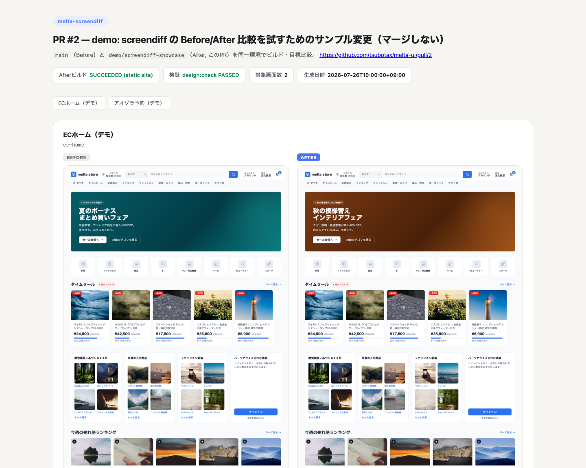

# melta-screendiff

UI変更PRを **Before/After の実キャプチャ** でレビューするための Claude Code plugin。

PR番号を渡すと、PRのbaseブランチ（Before）とPRブランチ（After）をそれぞれ checkout → ビルド → 対象画面をキャプチャし、横並びの比較HTMLを生成する。レビュアーは手元でビルドせずに視覚差分を判断できる。

- **web backend**: dev server起動 + Playwrightフルページ撮影（Chrome フォールバックあり）
- **ios backend**: シミュレータービルド + deep link起動 + ページング撮影（スクロール全域カバー）+ VoiceOver重複読み上げ検査
- 比較HTMLの生成は画像をAIのコンテキストに通さない（PNGを直接base64でHTMLに埋め込み。AIが画像をReadするのは差分コメントを書くための目視のみで、埋め込み枚数はトークンを消費しない）
- PRコメント投稿は下書き提示 → 人間承認のHITL（勝手に投稿しない）

## 生成される比較HTML



実例: [melta-ui #1](https://github.com/tsubotax/melta-ui/pull/1)（ヒーローを春キャンペーン → 夏セールに変更したPR）。ビルド結果・検証状況・対象画面数をヘッダに出し、画面ごとに Before/After を横並びで表示する。対象画面が複数ある場合は上部の目次リンクから各画面へ飛べる。

## インストール

```
/plugin marketplace add tsubotax/melta-screendiff
/plugin install screendiff@melta
```

## 前提条件

| 必須 | 用途 |
|---|---|
| gh CLI（認証済み） | PR diff/view/checkout/comment |
| Python 3 | scripts/ 実行（標準ライブラリのみ） |
| 対象リポジトリの設定ファイル | 下記「設定」参照 |

backend別:

| backend | 必須 | 任意（あると価値が上がる） |
|---|---|---|
| web | dev serverが1コマンドで立つこと | Playwright（無ければヘッドレスChromeでファーストビューのみ） |
| ios | 任意の画面をdeep linkで開けること・シミュレータービルドが1コマンドで通ること | [sim-use](https://github.com/lycorp-jp/sim-use) CLI（無ければ1ページ目のみ撮影） |

**iOSでdeep link基盤が無い場合は移植不可。まずUIカタログ（画面ID→View登録簿）+ URLスキームハンドラを作ること。**

## 設定

探索順（先に見つかったものを採用）:

1. `<repo>/.claude/screendiff.json` — チームとして導入するリポジトリ
2. `~/.config/melta-screendiff/<repo名>.json` — **対象リポジトリに1ファイルもコミットできない場合**（客先リポ等）のユーザー側設定

サンプルは [examples/](examples/)、全フィールドの説明は [docs/contracts.md](docs/contracts.md) を参照。最小構成（web）:

```json
{
  "backend": "web",
  "target_file_patterns": ["^src/(pages|components)/"],
  "web": { "serve_command": "npm run dev", "serve_url": "http://localhost:5173" },
  "screens": {
    "route_map": [
      { "file_pattern": "^src/pages/index\\.", "id": "home", "path": "/", "title": "ホーム" }
    ]
  }
}
```

web backend では `route_map` の各エントリに **`path`（"/" 始まり）が必須**。省略すると撮影URLが `serve_url` そのもの（＝トップページ）になり、「変更された画面」としてトップを撮ったまま気づけないため、設定読み込み時にエラーで落とす。認証が必要な画面はログイン画面にリダイレクトされた時点で中断する（現状、認証状態を持ち込む仕組みは未対応）。

変更ファイル→画面の解決が `route_map`（宣言的マッピング）で足りないリポジトリは、`screens.resolver_command` に自前の逆引きコマンドを指定できる（出力のJSON契約は docs/contracts.md §2）。

## 使い方

```
/screendiff:screendiff 42        # PR #42 をレビュー（plugin名:スキル名の名前空間付き）
```

処理フロー: 適用範囲判定 → Before/After 各々 checkout・ビルド・撮影 → 比較HTML生成（Artifact提示）→ PRコメント下書き（承認後のみ投稿）。PR作者が自分のPRに比較Artifactを添付する **authorモード** もある（SKILL.md参照）。

## 設計の背景

このスキルの手順の多くは実運用で起きた事故への対策としてルール化されている（stale binary/stale server対策、マージ済みPRのcheckout戦略、撮影失敗の成功偽装禁止、Cleanupの必須実行など）。詳細は [SKILL.md](skills/screendiff/SKILL.md) と [docs/contracts.md](docs/contracts.md) を参照。**冗長に見えても削らないこと。**

## Related

- **[melta UI](https://github.com/tsubotax/melta-ui)** — 人間にもAIにも読めるデザインシステム。DS違反を lint / CI / hook で機械的に検知する。screendiff は「機械が検知できない、見た目の意図」を人間がレビューする側を担当する。screendiff 自体は melta UI に依存しない。

## License

MIT
